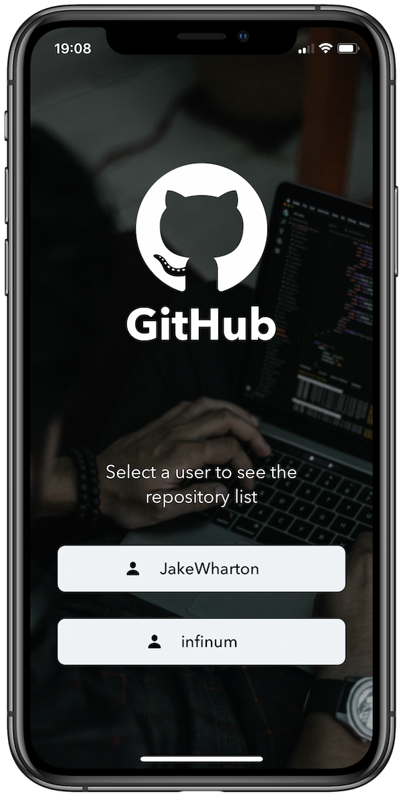
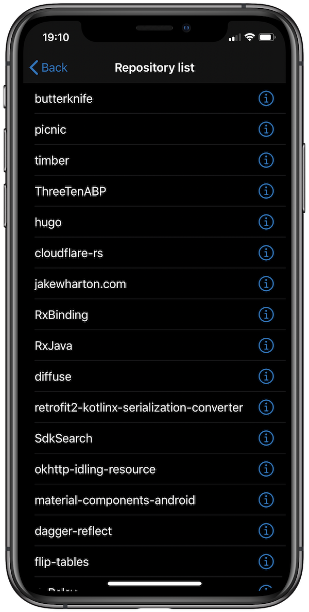
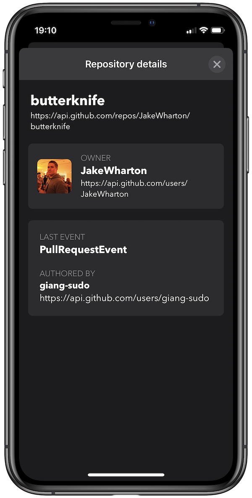

# GithubUsers &middot;   

This is a project I recently completed as part of the interview process for an iOS Developer role. The specs were to build a basic iOS application using the [Github API](https://developer.github.com/v3) to list the repositories of two specific users and show the details about the selected repository.

I'm quite happy with the final product: this app was built entirely in Swift, with no external dependencies, and the UI was all created programmatically using Auto Layout constraints. I used the MVVM pattern to have a better separation between the components.

This app also supports iOS Dark Mode.

&nbsp;&nbsp;&nbsp;&nbsp;&nbsp;&nbsp;&nbsp;&nbsp;